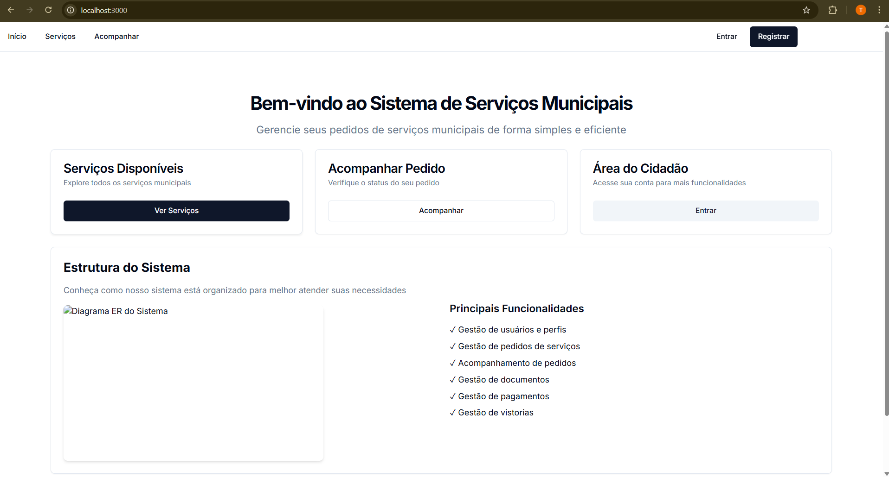

# Simple - Sistema de Gestão de Serviços Municipais



## 📋 Visão Geral

O **Simple** é uma aplicação completa para gestão de pedidos de serviços municipais, desenvolvida para facilitar o atendimento ao cidadão e otimizar os processos internos da administração municipal. A aplicação permite o registro, acompanhamento e gestão de diversos tipos de processos municipais, como legalização de imóveis, compra de lotes, pedidos de eventos, licenciamentos e emissão de plantas.

## 🏗️ Arquitetura

O projeto utiliza uma **arquitetura de microserviços** com os seguintes componentes:

### Microserviços
- **API Gateway** (Porta 9080) - Ponto de entrada único para todas as requisições
- **Auth Service** (Porta 9081) - Serviço de autenticação e autorização
- **Citizen Service** (Porta 9082) - Gestão de dados dos cidadãos
- **Order Service** (Porta 9083) - Gestão de pedidos e processos
- **Config Service** (Porta 9084) - Serviço de configurações
- **Favorites Service** (Porta 9085) - Gestão de favoritos dos usuários

### Frontend e Banco de Dados
- **Frontend Next.js** (Porta 9000) - Interface de usuário moderna e responsiva
- **PostgreSQL** (Porta 9433) - Banco de dados relacional

## 🚀 Tecnologias Utilizadas

### Backend
- **Java** - Linguagem de programação
- **Spring Boot** - Framework principal
- **Spring Cloud Gateway** - API Gateway
- **Spring Security** - Segurança e autenticação
- **Spring Data JPA** - Persistência de dados
- **JWT** - Autenticação baseada em tokens
- **PostgreSQL** - Banco de dados

### Frontend
- **Next.js** - Framework React
- **React** - Biblioteca de interface
- **Tailwind CSS** - Framework de estilização
- **TypeScript** - Tipagem estática

### DevOps
- **Docker** - Containerização
- **Docker Compose** - Orquestração de containers

## 📦 Estrutura do Projeto

```
simple/
├── api-gateway/          # API Gateway - Roteamento de requisições
├── auth-service/         # Serviço de autenticação
├── citizen-service/      # Serviço de gestão de cidadãos
├── order-service/        # Serviço de gestão de pedidos
├── config-service/       # Serviço de configurações
├── favorites-service/    # Serviço de favoritos
├── frontend/            # Aplicação Next.js
│   └── app/            # Código fonte do frontend
├── database/           # Scripts e esquemas do banco
├── docs/              # Documentação do projeto
│   ├── dev/          # Documentação para desenvolvedores
│   ├── user/         # Guias do usuário
│   └── wireframes/   # Wireframes da interface
├── k8s/              # Configurações Kubernetes
└── docker-compose.yml # Configuração Docker
```

## 🛠️ Instalação e Execução

### Pré-requisitos
- Docker Desktop
- Git (opcional)

### Execução com Docker (Recomendado)

1. **Clone o repositório:**
   ```bash
   git clone <URL_DO_REPOSITÓRIO>
   cd simple
   ```

2. **Configure as variáveis de ambiente:**
   ```bash
   cp .env.local.example .env.local
   # Edite o arquivo .env.local com suas configurações
   ```

3. **Execute a aplicação:**
   ```bash
   docker-compose up -d
   ```

4. **Acesse a aplicação:**
   - Frontend: http://localhost:9000
   - API Gateway: http://localhost:9080
   - Banco de dados: localhost:9433

### Verificação dos Serviços

```bash
# Verificar status dos containers
docker-compose ps

# Visualizar logs
docker-compose logs -f [nome-do-serviço]

# Parar a aplicação
docker-compose down
```

## 📚 Funcionalidades Principais

### Para Cidadãos
- 🔐 **Autenticação segura** - Login e registro de usuários
- 📋 **Solicitação de serviços** - Diversos tipos de pedidos municipais
- 📊 **Acompanhamento de processos** - Status em tempo real
- ⭐ **Favoritos** - Salvar serviços mais utilizados
- 📱 **Interface responsiva** - Acesso via desktop e mobile

### Para Funcionários
- 👥 **Gestão de cidadãos** - Cadastro e manutenção de dados
- 📝 **Processamento de pedidos** - Análise e aprovação
- 📈 **Dashboard administrativo** - Métricas e relatórios
- ⚙️ **Configurações do sistema** - Parâmetros e ajustes

## 🔧 Desenvolvimento

### Configuração do Ambiente de Desenvolvimento

Para informações detalhadas sobre configuração do ambiente de desenvolvimento, consulte:
- [Guia de Configuração](docs/dev/setup.md)
- [Arquitetura do Sistema](docs/dev/architecture.md)
- [Guia de Contribuição](docs/dev/contributing.md)

### Executando Serviços Individualmente

Cada microserviço pode ser executado independentemente para desenvolvimento:

```bash
# Exemplo para auth-service
cd auth-service
./mvnw spring-boot:run
```

## 📖 Documentação

### Para Desenvolvedores
- [Arquitetura](docs/dev/architecture.md) - Visão detalhada da arquitetura
- [Diagramas de Sequência](docs/dev/sequence_diagrams.md) - Fluxos da aplicação
- [Setup](docs/dev/setup.md) - Configuração do ambiente
- [Contribuição](docs/dev/contributing.md) - Como contribuir

### Para Usuários
- [Guia do Cidadão](docs/user/citizen_guide.md) - Como usar a plataforma
- [Guia do Atendente](docs/user/attendant_guide.md) - Manual para funcionários
- [FAQ](docs/user/faq.md) - Perguntas frequentes
- [Processos](docs/user/processes.md) - Tipos de processos disponíveis

### Docker
- [Docker README](docker-README.md) - Guia completo para execução com Docker

## 🗄️ Banco de Dados

O sistema utiliza PostgreSQL com:
- **Schema completo** em `database/schema.sql`
- **Dados de exemplo** em `database/sample_data.sql`
- **Diagrama ER** disponível em vários formatos na pasta `database/`

## 🔒 Segurança

- **JWT Tokens** para autenticação
- **Spring Security** para autorização
- **Criptografia de senhas** com BCrypt
- **Validação de entrada** em todos os endpoints
- **CORS configurado** para frontend

## 🚀 Deploy

### Docker Compose (Desenvolvimento/Teste)
```bash
docker-compose up -d
```

### Kubernetes (Produção)
Configuração disponível na pasta `k8s/` com overlays para diferentes ambientes.

## 🤝 Contribuição

1. Faça um fork do projeto
2. Crie uma branch para sua feature (`git checkout -b feature/AmazingFeature`)
3. Commit suas mudanças (`git commit -m 'Add some AmazingFeature'`)
4. Push para a branch (`git push origin feature/AmazingFeature`)
5. Abra um Pull Request

Consulte o [Guia de Contribuição](docs/dev/contributing.md) para mais detalhes.

## 📄 Licença

Este projeto está sob a licença [MIT](LICENSE).

## 📞 Suporte

Para suporte técnico ou dúvidas:
- Consulte a [documentação](docs/)
- Verifique as [perguntas frequentes](docs/user/faq.md)
- Abra uma issue no repositório

---

**Simple** - Simplificando a gestão de serviços municipais 🏛️