# Diagrama ER do Sistema 'Simple'

Este diagrama representa as relações entre as entidades do sistema de gestão de serviços municipais.

```mermaid
erDiagram
    ROLES {
        int id PK
        varchar name
        text description
        timestamp created_at
        timestamp updated_at
    }
    
    USERS {
        uuid id PK
        varchar username
        varchar password
        varchar email
        varchar full_name
        varchar cpf
        varchar phone
        int role_id FK
        boolean is_active
        timestamp last_login
        timestamp created_at
        timestamp updated_at
    }
    
    DEPARTMENTS {
        int id PK
        varchar name
        text description
        boolean is_active
        timestamp created_at
        timestamp updated_at
    }
    
    USER_DEPARTMENTS {
        uuid user_id PK,FK
        int department_id PK,FK
        boolean is_manager
        timestamp created_at
    }
    
    PROCESS_TYPES {
        int id PK
        varchar name
        text description
        int estimated_days
        int department_id FK
        boolean is_active
        boolean requires_payment
        timestamp created_at
        timestamp updated_at
    }
    
    PROCESS_STAGES {
        int id PK
        int process_type_id FK
        varchar name
        text description
        int sequence_order
        int estimated_days
        int department_id FK
        boolean requires_approval
        boolean requires_payment
        timestamp created_at
        timestamp updated_at
    }
    
    DOCUMENT_TYPES {
        int id PK
        varchar name
        text description
        boolean is_required
        timestamp created_at
        timestamp updated_at
    }
    
    PROCESS_REQUIRED_DOCUMENTS {
        int process_type_id PK,FK
        int document_type_id PK,FK
        boolean is_required
        int stage_id FK
        timestamp created_at
    }
    
    PROCESS_STATUS {
        int id PK
        varchar name
        text description
        boolean is_final
        varchar color
        timestamp created_at
        timestamp updated_at
    }
    
    REQUESTS {
        uuid id PK
        varchar protocol_number
        int process_type_id FK
        uuid requester_id FK
        int current_stage_id FK
        int current_status_id FK
        uuid assigned_to FK
        varchar title
        text description
        text property_address
        varchar property_registration
        boolean is_digital
        boolean is_priority
        text priority_reason
        date expected_completion_date
        timestamp completed_date
        timestamp created_at
        timestamp updated_at
    }
    
    REQUEST_STATUS_HISTORY {
        int id PK
        uuid request_id FK
        int status_id FK
        int stage_id FK
        uuid user_id FK
        text comments
        timestamp created_at
    }
    
    DOCUMENTS {
        uuid id PK
        uuid request_id FK
        int document_type_id FK
        varchar file_name
        varchar file_path
        int file_size
        varchar mime_type
        uuid uploaded_by FK
        boolean is_approved
        uuid approved_by FK
        timestamp approval_date
        text rejection_reason
        timestamp created_at
        timestamp updated_at
    }
    
    TRACKING_CODES {
        uuid id PK
        uuid request_id FK
        varchar code
        boolean is_active
        timestamp expiration_date
        timestamp created_at
    }
    
    PAYMENT_TYPES {
        int id PK
        varchar name
        text description
        boolean is_active
        timestamp created_at
        timestamp updated_at
    }
    
    PAYMENT_STATUS {
        int id PK
        varchar name
        text description
        timestamp created_at
        timestamp updated_at
    }
    
    PAYMENTS {
        uuid id PK
        uuid request_id FK
        int payment_type_id FK
        int status_id FK
        text description
        decimal amount
        int installments
        date due_date
        timestamp payment_date
        varchar receipt_number
        varchar receipt_file_path
        uuid created_by FK
        timestamp created_at
        timestamp updated_at
    }
    
    PAYMENT_INSTALLMENTS {
        int id PK
        uuid payment_id FK
        int installment_number
        decimal amount
        date due_date
        timestamp payment_date
        int status_id FK
        varchar receipt_number
        timestamp created_at
        timestamp updated_at
    }
    
    INSPECTIONS {
        uuid id PK
        uuid request_id FK
        uuid inspector_id FK
        timestamp scheduled_date
        timestamp completed_date
        varchar status
        text report
        boolean is_approved
        text rejection_reason
        timestamp created_at
        timestamp updated_at
    }
    
    INSPECTION_DOCUMENTS {
        uuid id PK
        uuid inspection_id FK
        varchar file_name
        varchar file_path
        int file_size
        varchar mime_type
        uuid uploaded_by FK
        timestamp created_at
    }
    
    DISPATCHES {
        uuid id PK
        uuid request_id FK
        int stage_id FK
        uuid user_id FK
        text content
        boolean is_approved
        timestamp decision_date
        uuid decision_by FK
        timestamp created_at
        timestamp updated_at
    }
    
    CONTRACTS {
        uuid id PK
        uuid request_id FK
        varchar contract_number
        varchar title
        text content
        date start_date
        date end_date
        boolean is_signed
        timestamp signed_date
        uuid signed_by FK
        varchar file_path
        uuid created_by FK
        timestamp created_at
        timestamp updated_at
    }
    
    CERTIFICATES {
        uuid id PK
        uuid request_id FK
        varchar certificate_number
        varchar title
        text content
        date issue_date
        date expiry_date
        varchar file_path
        uuid issued_by FK
        timestamp created_at
        timestamp updated_at
    }
    
    BLUEPRINTS {
        uuid id PK
        uuid request_id FK
        varchar blueprint_number
        varchar title
        text description
        date issue_date
        varchar file_path
        uuid issued_by FK
        timestamp created_at
        timestamp updated_at
    }
    
    LICENSES {
        uuid id PK
        uuid request_id FK
        varchar license_number
        varchar license_type
        varchar title
        text description
        date issue_date
        date expiry_date
        boolean is_renewal
        uuid previous_license_id FK
        varchar file_path
        uuid issued_by FK
        timestamp created_at
        timestamp updated_at
    }
    
    COMMENTS {
        uuid id PK
        uuid request_id FK
        uuid user_id FK
        text content
        boolean is_internal
        timestamp created_at
        timestamp updated_at
    }
    
    NOTIFICATIONS {
        uuid id PK
        uuid user_id FK
        varchar title
        text content
        boolean is_read
        timestamp read_at
        varchar notification_type
        uuid reference_id
        timestamp created_at
    }
    
    FAVORITES {
        int id PK
        uuid user_id FK
        int process_type_id FK
        timestamp created_at
    }
    
    MOST_USED_SERVICES {
        int id PK
        int process_type_id FK
        int count
        timestamp last_used
        timestamp created_at
        timestamp updated_at
    }
    
    SYSTEM_LOGS {
        int id PK
        uuid user_id FK
        varchar action
        varchar entity_type
        varchar entity_id
        jsonb details
        varchar ip_address
        text user_agent
        timestamp created_at
    }
    
    SYSTEM_SETTINGS {
        int id PK
        varchar setting_key
        text setting_value
        text description
        boolean is_public
        timestamp created_at
        timestamp updated_at
    }
    
    ROLES ||--o{ USERS : "tem"
    USERS ||--o{ USER_DEPARTMENTS : "pertence"
    DEPARTMENTS ||--o{ USER_DEPARTMENTS : "contém"
    DEPARTMENTS ||--o{ PROCESS_TYPES : "gerencia"
    DEPARTMENTS ||--o{ PROCESS_STAGES : "responsável"
    PROCESS_TYPES ||--o{ PROCESS_STAGES : "contém"
    PROCESS_TYPES ||--o{ PROCESS_REQUIRED_DOCUMENTS : "requer"
    DOCUMENT_TYPES ||--o{ PROCESS_REQUIRED_DOCUMENTS : "é requerido por"
    PROCESS_STAGES ||--o{ PROCESS_REQUIRED_DOCUMENTS : "requer"
    PROCESS_TYPES ||--o{ REQUESTS : "categoriza"
    PROCESS_STAGES ||--o{ REQUESTS : "está em"
    PROCESS_STATUS ||--o{ REQUESTS : "status atual"
    USERS ||--o{ REQUESTS : "solicita"
    USERS ||--o{ REQUESTS : "atribuído a"
    REQUESTS ||--o{ REQUEST_STATUS_HISTORY : "tem histórico"
    PROCESS_STATUS ||--o{ REQUEST_STATUS_HISTORY : "status anterior"
    PROCESS_STAGES ||--o{ REQUEST_STATUS_HISTORY : "etapa anterior"
    USERS ||--o{ REQUEST_STATUS_HISTORY : "alterado por"
    REQUESTS ||--o{ DOCUMENTS : "contém"
    DOCUMENT_TYPES ||--o{ DOCUMENTS : "categoriza"
    USERS ||--o{ DOCUMENTS : "enviado por"
    USERS ||--o{ DOCUMENTS : "aprovado por"
    REQUESTS ||--o{ TRACKING_CODES : "tem"
    PAYMENT_TYPES ||--o{ PAYMENTS : "tipo"
    PAYMENT_STATUS ||--o{ PAYMENTS : "status"
    REQUESTS ||--o{ PAYMENTS : "tem"
    USERS ||--o{ PAYMENTS : "criado por"
    PAYMENTS ||--o{ PAYMENT_INSTALLMENTS : "tem"
    PAYMENT_STATUS ||--o{ PAYMENT_INSTALLMENTS : "status"
    REQUESTS ||--o{ INSPECTIONS : "tem"
    USERS ||--o{ INSPECTIONS : "inspecionado por"
    INSPECTIONS ||--o{ INSPECTION_DOCUMENTS : "tem"
    USERS ||--o{ INSPECTION_DOCUMENTS : "enviado por"
    REQUESTS ||--o{ DISPATCHES : "tem"
    PROCESS_STAGES ||--o{ DISPATCHES : "na etapa"
    USERS ||--o{ DISPATCHES : "criado por"
    USERS ||--o{ DISPATCHES : "decidido por"
    REQUESTS ||--o{ CONTRACTS : "tem"
    USERS ||--o{ CONTRACTS : "assinado por"
    USERS ||--o{ CONTRACTS : "criado por"
    REQUESTS ||--o{ CERTIFICATES : "tem"
    USERS ||--o{ CERTIFICATES : "emitido por"
    REQUESTS ||--o{ BLUEPRINTS : "tem"
    USERS ||--o{ BLUEPRINTS : "emitido por"
    REQUESTS ||--o{ LICENSES : "tem"
    LICENSES ||--o{ LICENSES : "renovação de"
    USERS ||--o{ LICENSES : "emitido por"
    REQUESTS ||--o{ COMMENTS : "tem"
    USERS ||--o{ COMMENTS : "comentado por"
    USERS ||--o{ NOTIFICATIONS : "recebe"
    USERS ||--o{ FAVORITES : "tem"
    PROCESS_TYPES ||--o{ FAVORITES : "favorito"
    PROCESS_TYPES ||--o{ MOST_USED_SERVICES : "utilização"
    USERS ||--o{ SYSTEM_LOGS : "ação de"
```

## Descrição das Principais Relações

1. **Utilizadores e Perfis**:
   - Cada utilizador possui um perfil (ADMIN, MANAGER, ATTENDANT, TECHNICIAN, CITIZEN)
   - Utilizadores podem pertencer a departamentos específicos

2. **Processos e Etapas**:
   - Cada tipo de processo (Legalização, Compra de Lote, etc.) possui várias etapas sequenciais
   - Cada etapa pode exigir documentos específicos e ser responsabilidade de um departamento

3. **Pedidos e Status**:
   - Cada pedido está associado a um tipo de processo e possui um status atual
   - O histórico de status registra todas as mudanças de estado do pedido

4. **Documentos**:
   - Documentos são associados a pedidos específicos
   - Cada documento tem um tipo e pode ser aprovado/rejeitado

5. **Pagamentos**:
   - Pagamentos são associados a pedidos
   - Pagamentos podem ser parcelados (tabela de parcelas)

6. **Vistorias**:
   - Vistorias são agendadas para pedidos específicos
   - Vistorias podem ter documentos anexados (fotos, relatórios)

7. **Documentos Finais**:
   - Contratos, Certidões, Plantas e Licenças são documentos finais gerados para pedidos
   - Cada um tem suas próprias características e fluxos

8. **Interações**:
   - Comentários permitem comunicação sobre os pedidos
   - Notificações informam utilizadores sobre atualizações
   - Favoritos e serviços mais utilizados melhoram a experiência do utilizador

## Observações sobre o Modelo

- Utilização de UUIDs para identificadores únicos de entidades principais
- Rastreamento de criação/atualização em todas as tabelas
- Suporte a fluxos digitais e manuais
- Histórico completo de alterações de status
- Suporte a diferentes tipos de pagamento e parcelamento
