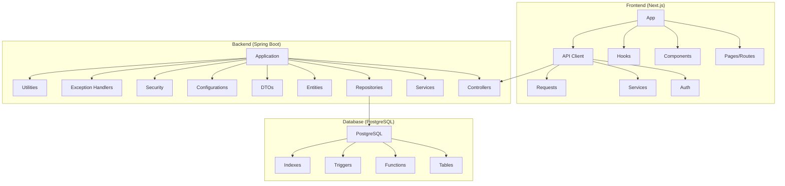
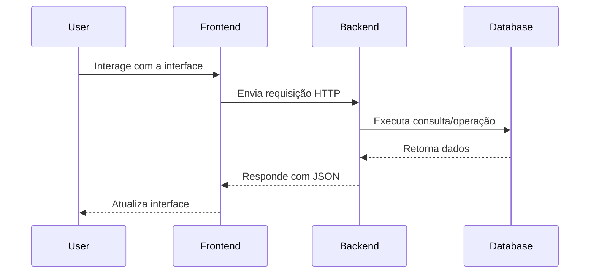

# Arquitetura do Sistema Simple

## Visão Geral da Arquitetura

O Simple é uma aplicação web moderna baseada em uma arquitetura de três camadas (three-tier architecture), com separação clara entre banco de dados, backend e frontend. A aplicação segue os princípios de design RESTful e utiliza containers Docker para facilitar a implantação.

## Diagrama de Pacotes

## Componentes Principais

### 1. Banco de Dados (PostgreSQL)

O banco de dados PostgreSQL é o componente responsável pelo armazenamento persistente de todos os dados da aplicação. Ele implementa um modelo relacional complexo que suporta todos os aspectos do sistema de gestão de pedidos.

#### Principais Entidades:
- **Utilizadores e Perfis**: Armazena informações sobre funcionários municipais e suas permissões
- **Cidadãos**: Dados dos solicitantes de serviços
- **Pedidos**: Registros de solicitações de serviços
- **Tipos de Serviços e Etapas**: Configuração dos fluxos de trabalho
- **Documentos**: Arquivos anexados aos pedidos
- **Pagamentos**: Registros financeiros
- **Vistorias**: Informações sobre inspeções realizadas
- **Lotes e Plantas**: Dados específicos para serviços imobiliários

#### Características Técnicas:
- Uso de extensões PostgreSQL como uuid-ossp e pgcrypto
- Implementação de triggers para automação de processos
- Funções PL/pgSQL para lógica de negócio no banco
- Índices otimizados para consultas frequentes
- Constraints para garantir integridade dos dados

### 2. Backend (Spring Boot)

O backend é implementado em Java com Spring Boot, seguindo uma arquitetura em camadas que separa claramente as responsabilidades.

#### Camadas Principais:
- **Controllers**: Endpoints REST que recebem requisições HTTP e retornam respostas
- **Services**: Implementação da lógica de negócio
- **Repositories**: Acesso ao banco de dados usando Spring Data JPA
- **Entities**: Mapeamento objeto-relacional das tabelas do banco
- **DTOs**: Objetos para transferência de dados entre camadas
- **Security**: Configuração de autenticação e autorização

#### Padrões de Design Utilizados:
- **Repository Pattern**: Para abstração do acesso a dados
- **Service Layer**: Para encapsulamento da lógica de negócio
- **DTO Pattern**: Para transferência de dados entre camadas
- **Dependency Injection**: Para acoplamento fraco entre componentes
- **Exception Handling**: Tratamento centralizado de exceções

### 3. Frontend (Next.js)

O frontend é desenvolvido com Next.js, um framework React que oferece renderização do lado do servidor (SSR) e geração de sites estáticos (SSG), melhorando a performance e SEO.

#### Estrutura Principal:
- **Pages/Routes**: Implementação das diferentes telas da aplicação
- **Components**: Componentes React reutilizáveis
- **Hooks**: Lógica compartilhada entre componentes
- **API Client**: Comunicação com o backend
- **Context Providers**: Gerenciamento de estado global

#### Características Técnicas:
- Arquitetura baseada em componentes
- Estilização com Tailwind CSS
- Formulários com validação
- Autenticação e controle de acesso
- Tratamento de erros e feedback ao utilizador

## Fluxo de Dados

## Comunicação entre Componentes

### Frontend para Backend
- Comunicação via API RESTful
- Requisições HTTP (GET, POST, PUT, DELETE)
- Dados em formato JSON
- Autenticação via JWT (JSON Web Token)

### Backend para Banco de Dados
- Comunicação via JDBC
- Mapeamento objeto-relacional com Hibernate/JPA
- Transações gerenciadas pelo Spring

## Segurança

A aplicação implementa várias camadas de segurança:

1. **Autenticação**: Sistema baseado em JWT para autenticação de utilizadores
2. **Autorização**: Controle de acesso baseado em perfis e permissões
3. **Validação de Dados**: Validação em todos os níveis (frontend, backend e banco)
4. **Proteção contra Ataques Comuns**: XSS, CSRF, SQL Injection
5. **Criptografia**: Senhas armazenadas com hash e salt

## Escalabilidade e Performance

A arquitetura foi projetada considerando aspectos de escalabilidade:

1. **Containerização**: Facilita a implantação em múltiplos ambientes
2. **Separação de Responsabilidades**: Permite escalar componentes independentemente
3. **Otimização de Banco**: Índices e consultas otimizadas
4. **Caching**: Implementado em níveis estratégicos

## Considerações de Implantação

A aplicação é implantada usando Docker e Docker Compose, o que facilita:

1. **Consistência de Ambiente**: Mesmo comportamento em desenvolvimento e produção
2. **Facilidade de Implantação**: Processo simplificado com docker-compose
3. **Isolamento**: Cada componente opera em seu próprio container
4. **Gerenciamento de Dependências**: Simplificado pelo uso de imagens Docker
