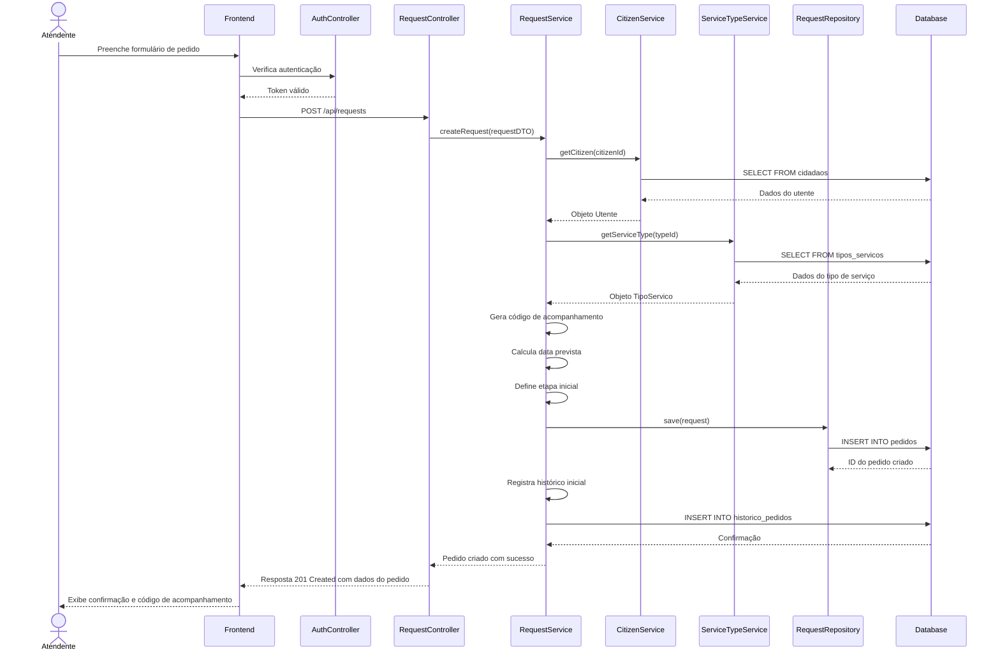
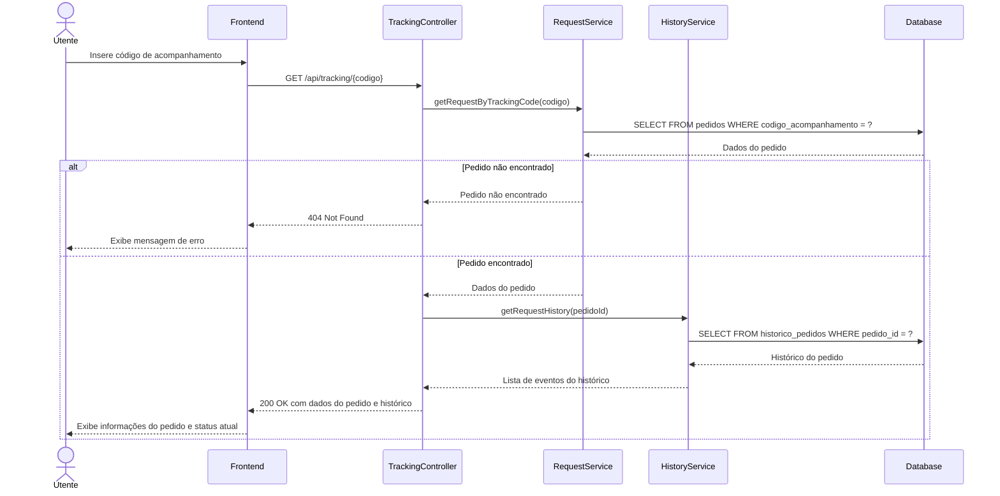
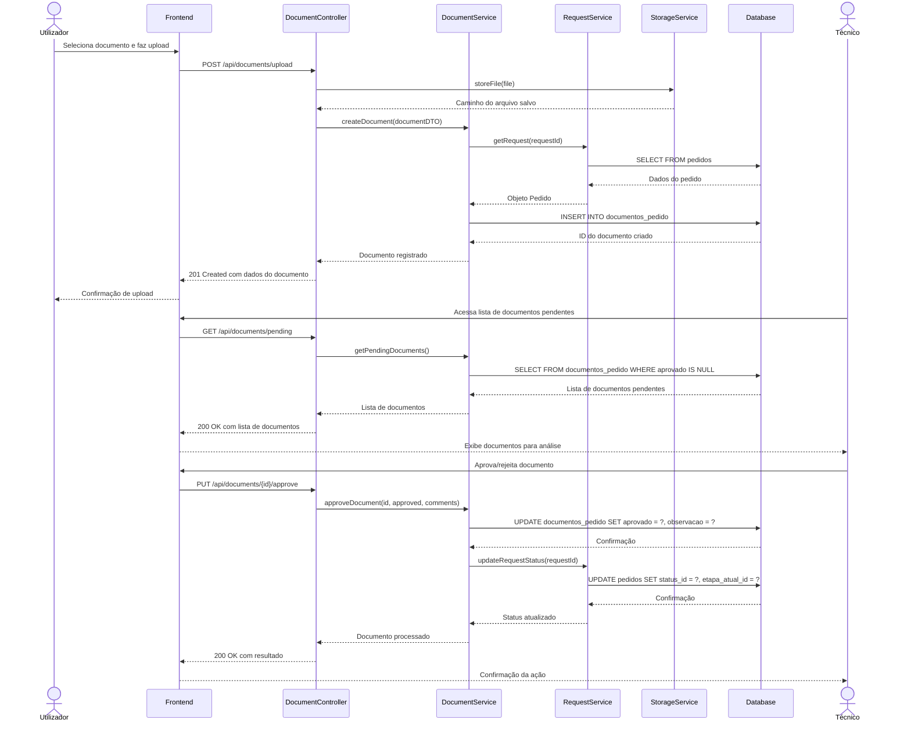
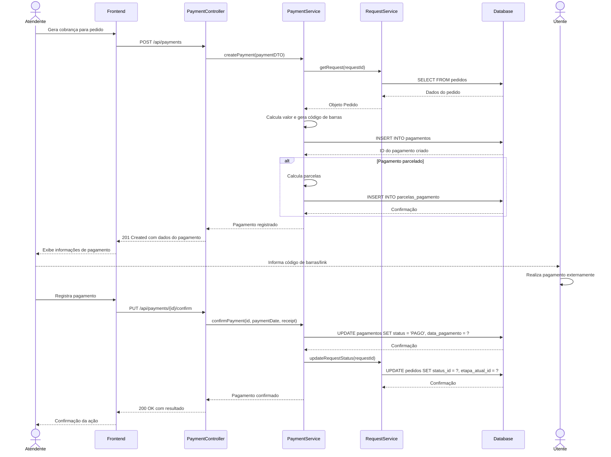
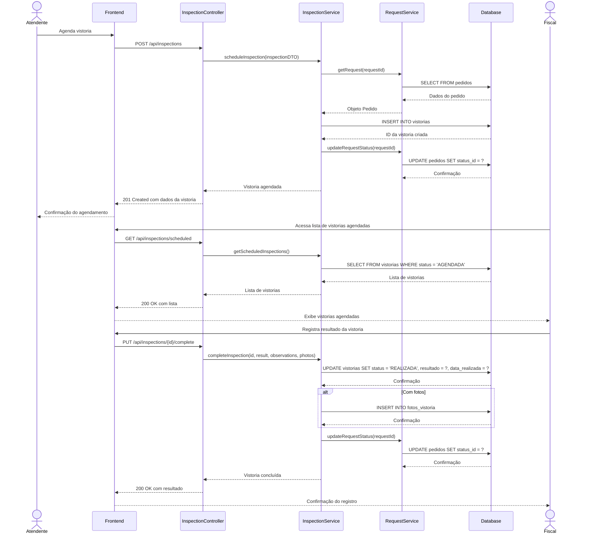

# Diagramas de Sequência

Este documento apresenta os diagramas de sequência para os principais fluxos da aplicação Simple. Os diagramas ilustram as interações entre os diferentes componentes do sistema e ajudam a entender como os processos são executados.

## 1. Registro de Novo Pedido

Este diagrama mostra o fluxo completo de registro de um novo pedido de serviço, desde a interação do atendente até a persistência no banco de dados.

## 2. Consulta de Status de Pedido pelo Utente

Este diagrama ilustra como um utente pode consultar o status de seu pedido usando o código de acompanhamento.

## 3. Fluxo de Aprovação de Documentos

Este diagrama mostra o processo de upload, análise e aprovação de documentos em um pedido.

## 4. Fluxo de Pagamento

Este diagrama ilustra o processo de geração, pagamento e confirmação de uma taxa municipal.

## 5. Agendamento e Realização de Vistoria

Este diagrama mostra o processo de agendamento, realização e registro de resultado de uma vistoria.

Estes diagramas representam os principais fluxos da aplicação Simple. Eles servem como referência para entender como os diferentes componentes interagem e como os processos são executados no sistema.
