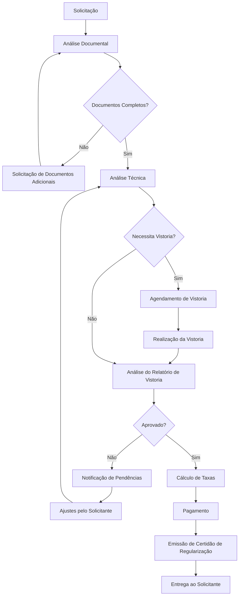
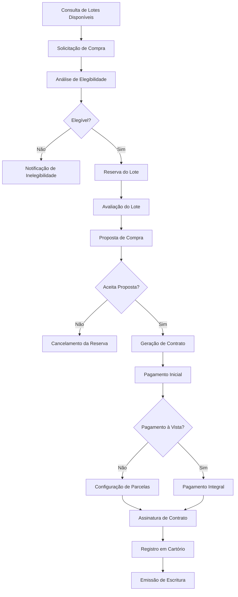
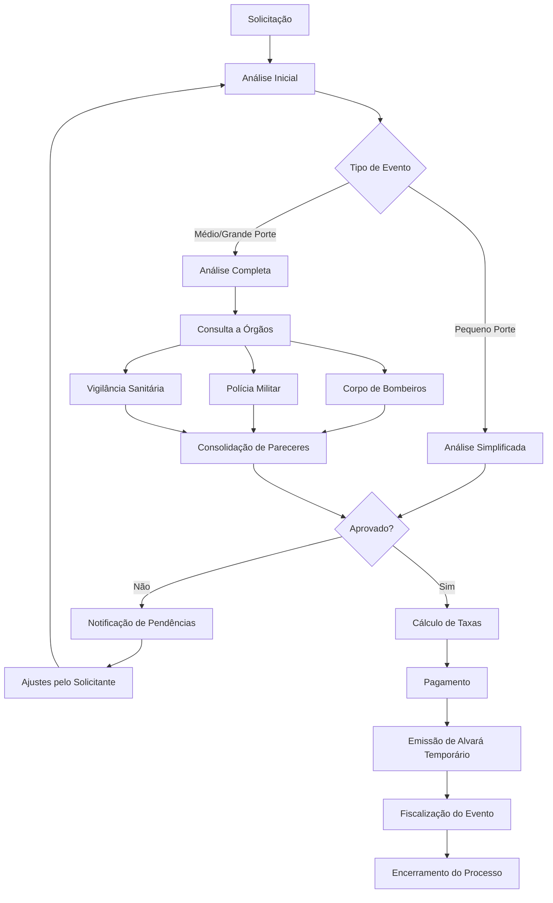
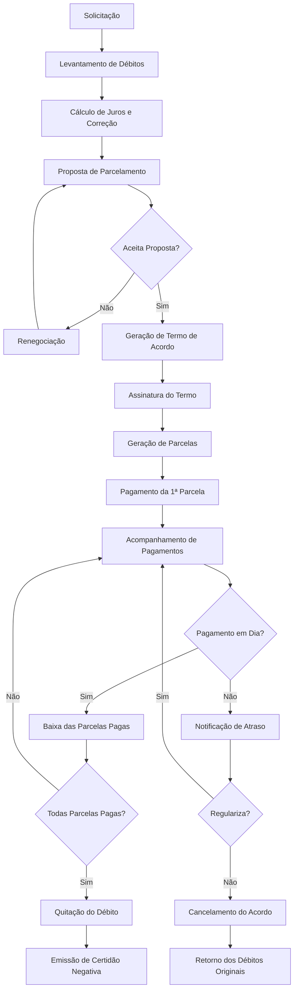
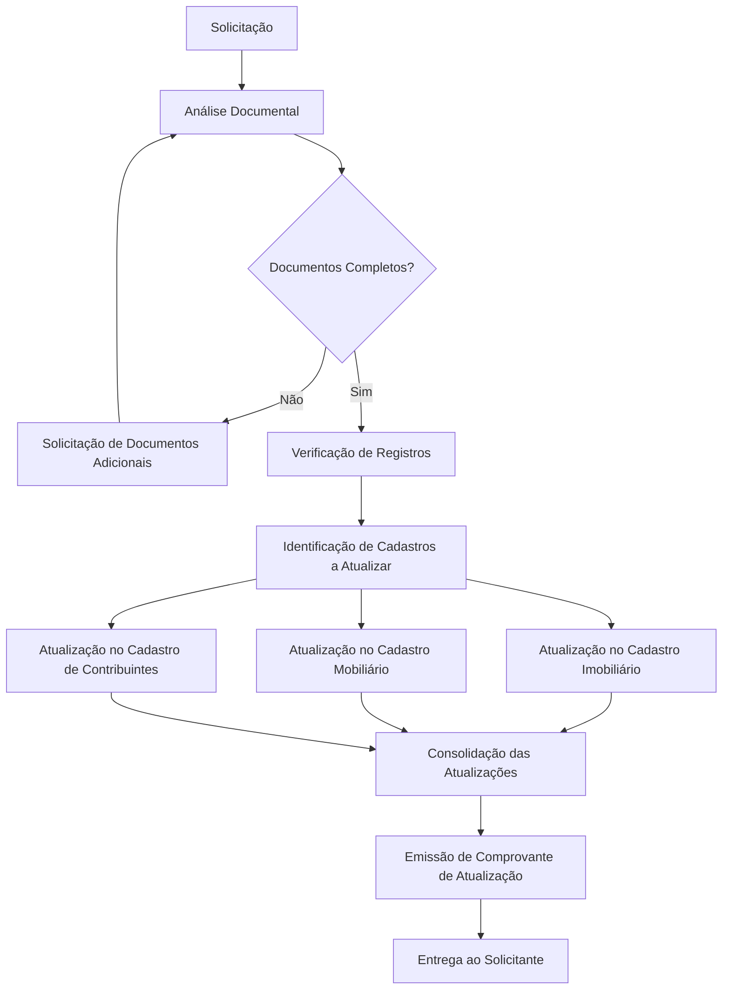
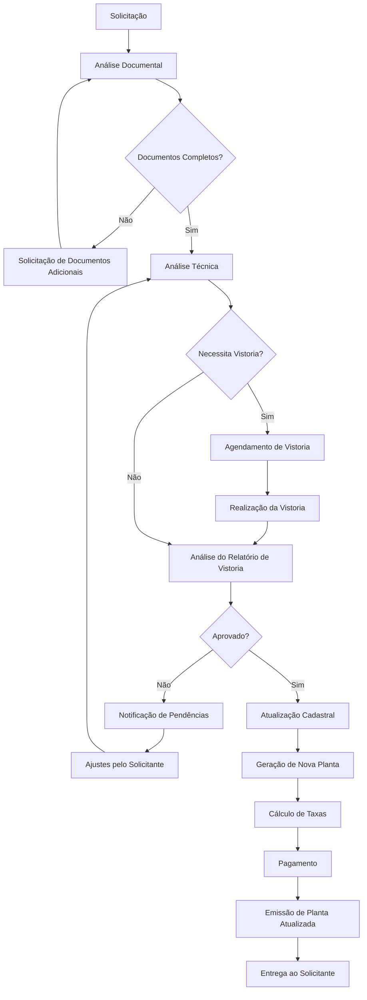
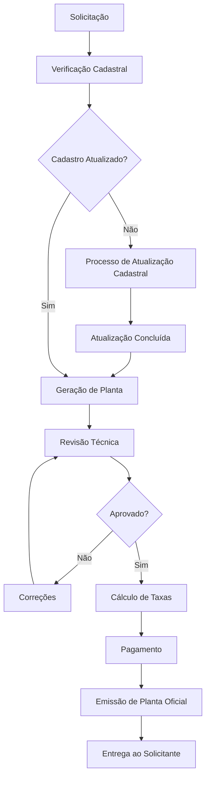
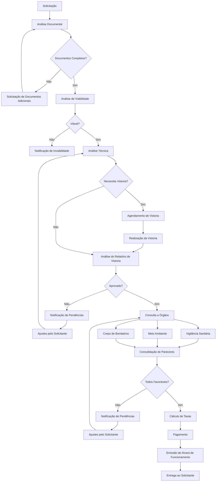
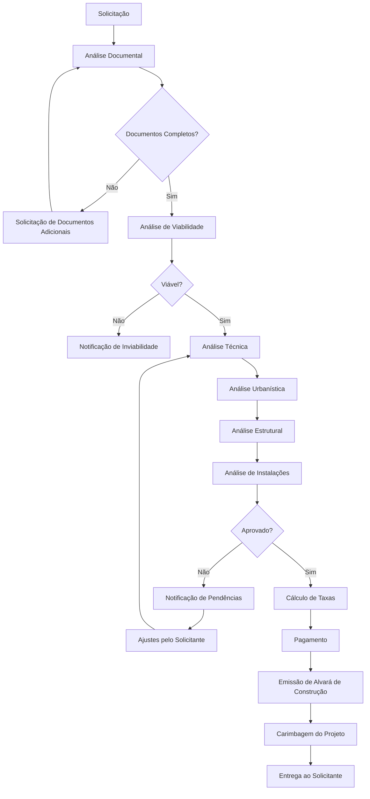
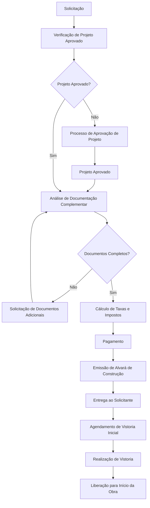

# Descrição dos Fluxos de Processos

Este documento descreve em detalhes os principais fluxos de processos disponíveis no sistema Simple. Cada processo possui etapas específicas, requisitos documentais e prazos estimados.

## Sumário

1. [Visão Geral dos Processos](#visão-geral-dos-processos)
2. [Legalização de Imóveis](#legalização-de-imóveis)
3. [Compra de Lote](#compra-de-lote)
4. [Pedido de Eventos](#pedido-de-eventos)
5. [Pagamento em Prestação](#pagamento-em-prestação)
6. [Mudança de Nome](#mudança-de-nome)
7. [Atualização de Planta](#atualização-de-planta)
8. [Emissão de Planta](#emissão-de-planta)
9. [Licenciamento Comercial](#licenciamento-comercial)
10. [Aprovação de Projetos](#aprovação-de-projetos)
11. [Licença de Construção](#licença-de-construção)

## Visão Geral dos Processos

Todos os processos no sistema Simple seguem um fluxo geral que inclui:

1. **Solicitação**: Registro inicial do pedido
2. **Análise Documental**: Verificação dos documentos enviados
3. **Análise Técnica**: Avaliação técnica do pedido (quando aplicável)
4. **Vistoria**: Inspeção no local (quando aplicável)
5. **Pagamento**: Quitação de taxas e emolumentos
6. **Aprovação**: Decisão final sobre o pedido
7. **Emissão**: Geração de documentos ou certificados
8. **Entrega**: Disponibilização do resultado ao solicitante

Cada tipo de processo pode ter variações neste fluxo, com etapas adicionais ou simplificadas, conforme detalhado a seguir.

## Legalização de Imóveis

### Descrição
Processo para regularização de imóveis construídos sem aprovação prévia ou em desacordo com a legislação municipal.

### Fluxo do Processo

### Documentos Necessários
- Documento de identidade e CPF do proprietário
- Comprovante de propriedade (escritura, contrato de compra e venda)
- Planta do imóvel assinada por profissional habilitado
- ART/RRT do responsável técnico
- Fotos do imóvel (fachada e interiores)
- Comprovante de endereço
- Certidão negativa de débitos municipais

### Prazos Estimados
- Análise documental: 5 dias úteis
- Análise técnica: 10 dias úteis
- Vistoria: 7 dias úteis após agendamento
- Emissão de certidão: 3 dias úteis após aprovação e pagamento
- **Prazo total estimado**: 25 a 30 dias úteis

### Taxas Aplicáveis
- Taxa de análise: Calculada com base na área construída
- Taxa de regularização: Calculada conforme legislação municipal
- Taxa de emissão de certidão

## Compra de Lote

### Descrição
Processo para aquisição de lotes municipais disponíveis para venda.

### Fluxo do Processo

### Documentos Necessários
- Documento de identidade e CPF do comprador
- Comprovante de renda
- Comprovante de residência
- Certidão de nascimento/casamento
- Certidão negativa de débitos municipais, estaduais e federais
- Declaração de não possuir outro imóvel (quando aplicável)

### Prazos Estimados
- Análise de elegibilidade: 5 dias úteis
- Avaliação do lote: 10 dias úteis
- Geração de contrato: 7 dias úteis
- Registro em cartório: Depende do cartório local
- **Prazo total estimado**: 30 a 45 dias úteis

### Taxas Aplicáveis
- Valor do lote: Conforme avaliação
- Taxa de administração: Percentual sobre o valor do lote
- Custas cartoriais: Conforme tabela do cartório

## Pedido de Eventos

### Descrição
Processo para obtenção de autorização para realização de eventos em espaços públicos ou privados que necessitem de alvará municipal.

### Fluxo do Processo

### Documentos Necessários
- Documento de identidade e CPF do responsável
- Descrição detalhada do evento (data, horário, público estimado)
- Croqui do local com disposição de estruturas
- Contrato de locação ou autorização de uso do espaço
- Contrato com empresa de segurança (para eventos de médio/grande porte)
- ART/RRT das estruturas temporárias (palcos, tendas, etc.)
- Plano de prevenção e combate a incêndio (para eventos de médio/grande porte)
- Autorização da polícia militar (quando aplicável)
- Comprovante de contratação de ambulância (para eventos de grande porte)

### Prazos Estimados
- Eventos de pequeno porte: 5 dias úteis
- Eventos de médio porte: 10 dias úteis
- Eventos de grande porte: 20 dias úteis
- **Prazo mínimo para solicitação**: 30 dias antes do evento (grande porte)

### Taxas Aplicáveis
- Taxa de análise: Valor fixo por tipo de evento
- Taxa de alvará: Calculada com base no tipo, duração e porte do evento
- Taxa de uso de espaço público (quando aplicável)

## Pagamento em Prestação

### Descrição
Processo para parcelamento de débitos municipais, incluindo impostos, taxas e multas.

### Fluxo do Processo

### Documentos Necessários
- Documento de identidade e CPF do devedor
- Comprovante de residência
- Documentos comprobatórios da dívida (carnês, notificações)
- Procuração (se representante legal)
- Contrato social e CNPJ (se pessoa jurídica)

### Prazos Estimados
- Levantamento de débitos: 2 dias úteis
- Geração de proposta: 1 dia útil
- Formalização do acordo: 2 dias úteis
- **Prazo total estimado**: 5 dias úteis

### Condições de Parcelamento
- Entrada mínima: 10% do valor total
- Número máximo de parcelas: 36 vezes
- Valor mínimo da parcela: Conforme legislação municipal
- Juros: Conforme legislação municipal

## Mudança de Nome

### Descrição
Processo para atualização de nome em registros municipais após alteração legal (casamento, divórcio, decisão judicial).

### Fluxo do Processo

### Documentos Necessários
- Documento de identidade e CPF (atual)
- Certidão de casamento, divórcio ou averbação
- Decisão judicial (quando aplicável)
- Comprovante de residência
- Documentos de propriedade com nome anterior
- Cartão CNPJ atualizado (se pessoa jurídica)

### Prazos Estimados
- Análise documental: 2 dias úteis
- Atualização de cadastros: 3 dias úteis
- Emissão de comprovantes: 1 dia útil
- **Prazo total estimado**: 6 dias úteis

### Taxas Aplicáveis
- Taxa de atualização cadastral (quando aplicável)
- Taxa de emissão de certidões atualizadas

## Atualização de Planta

### Descrição
Processo para atualização de planta cadastral após modificações no imóvel, desmembramento ou unificação de lotes.

### Fluxo do Processo

### Documentos Necessários
- Documento de identidade e CPF do proprietário
- Comprovante de propriedade atualizado
- Planta anterior
- Nova planta assinada por profissional habilitado
- ART/RRT do responsável técnico
- Memorial descritivo das alterações
- Certidão negativa de débitos municipais

### Prazos Estimados
- Análise documental: 5 dias úteis
- Análise técnica: 7 dias úteis
- Vistoria: 5 dias úteis após agendamento
- Atualização cadastral: 3 dias úteis
- **Prazo total estimado**: 20 dias úteis

### Taxas Aplicáveis
- Taxa de análise técnica
- Taxa de vistoria (quando aplicável)
- Taxa de emissão de nova planta

## Emissão de Planta

### Descrição
Processo para emissão de planta cadastral de imóvel já regularizado.

### Fluxo do Processo

### Documentos Necessários
- Documento de identidade e CPF do solicitante
- Comprovante de propriedade ou autorização do proprietário
- Comprovante de endereço
- Certidão negativa de débitos municipais

### Prazos Estimados
- Verificação cadastral: 2 dias úteis
- Geração de planta: 3 dias úteis
- Revisão e aprovação: 2 dias úteis
- **Prazo total estimado**: 7 dias úteis

### Taxas Aplicáveis
- Taxa de emissão de planta
- Taxa de atualização cadastral (quando aplicável)

## Licenciamento Comercial

### Descrição
Processo para obtenção de licença de funcionamento para estabelecimentos comerciais, industriais ou de serviços.

### Fluxo do Processo

### Documentos Necessários
- CNPJ da empresa
- Contrato social ou MEI
- Documento de identidade e CPF dos sócios
- Comprovante de endereço do estabelecimento
- Contrato de locação ou escritura do imóvel
- Certificado do Corpo de Bombeiros
- Licença sanitária (quando aplicável)
- Licença ambiental (quando aplicável)
- Projeto arquitetônico do estabelecimento
- ART/RRT do responsável técnico
- Certidão negativa de débitos municipais

### Prazos Estimados
- Análise documental: 5 dias úteis
- Análise de viabilidade: 5 dias úteis
- Análise técnica: 7 dias úteis
- Vistoria: 5 dias úteis após agendamento
- Consulta a órgãos: 10 dias úteis
- Emissão de alvará: 3 dias úteis após aprovação e pagamento
- **Prazo total estimado**: 30 a 45 dias úteis

### Taxas Aplicáveis
- Taxa de análise de viabilidade
- Taxa de vistoria
- Taxa de licenciamento (varia conforme atividade e área)
- Taxa de emissão de alvará

## Aprovação de Projetos

### Descrição
Processo para aprovação de projetos arquitetônicos para construção, reforma ou ampliação de edificações.

### Fluxo do Processo

### Documentos Necessários
- Documento de identidade e CPF do proprietário
- Comprovante de propriedade (escritura, contrato)
- Projeto arquitetônico completo (plantas, cortes, fachadas)
- Memorial descritivo
- ART/RRT dos responsáveis técnicos
- Projetos complementares (estrutural, elétrico, hidráulico)
- Certidão de diretrizes urbanísticas
- Certidão negativa de débitos municipais
- Licença ambiental (quando aplicável)

### Prazos Estimados
- Análise documental: 5 dias úteis
- Análise de viabilidade: 5 dias úteis
- Análise técnica: 15 dias úteis
- Emissão de alvará: 5 dias úteis após aprovação e pagamento
- **Prazo total estimado**: 30 dias úteis

### Taxas Aplicáveis
- Taxa de análise de projeto (calculada por m²)
- Taxa de emissão de alvará de construção
- Taxa de aprovação de projetos complementares

## Licença de Construção

### Descrição
Processo para obtenção de licença para iniciar obras de construção, reforma ou ampliação após a aprovação do projeto.

### Fluxo do Processo

### Documentos Necessários
- Projeto aprovado pela prefeitura
- ART/RRT de execução da obra
- Comprovante de pagamento de ISS do responsável técnico
- Cronograma de execução da obra
- Comprovante de recolhimento de taxas
- Termo de responsabilidade técnica
- Licenças específicas (ambiental, patrimônio histórico, etc.)

### Prazos Estimados
- Verificação de projeto: 2 dias úteis
- Análise de documentação: 5 dias úteis
- Emissão de alvará: 3 dias úteis após pagamento
- Vistoria inicial: 5 dias úteis após solicitação
- **Prazo total estimado**: 15 dias úteis

### Taxas Aplicáveis
- Taxa de emissão de alvará de construção
- ISS antecipado (quando aplicável)
- Taxa de vistoria
- Caução (para obras de grande porte)

### Validade e Renovação
- Validade do alvará: Conforme cronograma aprovado (geralmente 2 anos)
- Renovação: Deve ser solicitada 30 dias antes do vencimento
- Taxa de renovação: Percentual do valor original

---

Estes são os principais fluxos de processos disponíveis no sistema Simple. Cada processo foi projetado para garantir eficiência, transparência e conformidade com a legislação municipal. Para mais informações sobre um processo específico, consulte o departamento responsável ou entre em contato com o suporte ao cidadão.
